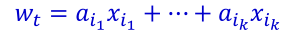
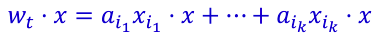
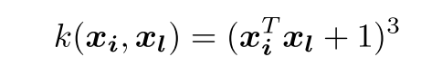
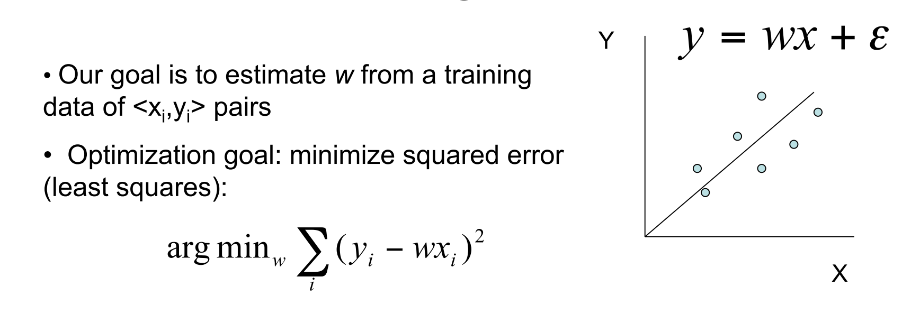

#Machine Learning

##Kernel

**Why Kernel Method is useful?**

Machine learning techniques try to classify samples from different sets by looking for separators in space to separate them. However, in reality, samples cannot always be separable. It is something Kernel could help. Kernels map samples from low dimension to high dimension where the low-dimensional samples can be separated after being mapped to higher dimensional space.

The mapping/expanding process can be thought as deriving new features from old features. For instance, a sample [x1, x2] can be mapped to high dimension space [x1^2, x2^2, x1x2, x2x1]. If we can simply do this to any training samples and testing samples, then problem solved! Why do we need kernel? 

It turns out that doing this brutal force feature expanding is very computational expansive. Therefore, we need to come up with a smarter solution and that is kernel. 

**How it is achieved?**

The guy who invented kernel found a very important pattern of any machine-learning algorithm. That is they all (at least SVM and Perceptron) deal with the testing sample by doing dot product. Here is an example:



Where Wt is the separator in the Perceptron Algorithm while Xin is the training sample. The way it classifies the testing sample is by simply dot product the new samples with all its components:



See the interaction between the training data and the testing data? It dot products them.

The guy who invented kernel also found out that even expanding both training and testing sample to high dimensional space, the dot product result of them can be expressed in a *really simple* form. This way the computational cost is reduced while we can still enjoy the separability from high dimensional space.

What are the simple forms of the dot products depends on what kernel we use:


There is a nice example of applying kernel method to perceptrons. <https://en.wikipedia.org/wiki/Kernel_perceptron>

##Perceptron
Perceptron uses two steps of computation to classify samples as one of the two labels. First, it does a dot product between linear seperator and input vector. Second it uses a threshold to test if the result from the dot production and output a binary value as the label. Here is an example of a two-demension perceptron with a threshold b: Sign(W1*X1 + W2*X2 - b).

Perceptron can be thought of as a single-layer Neural Network.

A perceptron:


**How to train a perceptron**

In the online learning situation, where we get training data sequentially, the misclassified instance will contribute to the seperator by dragging it towards the direction of that misclassified sample a bit. Therefore next time the mistake is less likely to happen by a bit more. 

Here is the code:

```
%Perceptron algorithm
%   w0 is the initial weight vector (d * 1)
%   X is feature values of training examples (d * n)
%   Y is labels of training examples (1 * n)

for j = 1 : n
	y_hat(j) = perceptron_pred(w , X(:,j));
		if(y_hat(j) ~= Y(j))
				w = w+Y(j)*X(:,j); % drag by adding the misclassified label to the weights vector
		end
end
```
**How to kernelize a perceptron**

Kernelized perceptron stores a counter vector that keep track of the times Xi is misclassified; and the set of training data as a trained model. The set of training data is stored in the form of a kernel matrix K as a lookup table. The kernel matrix should be constructed such that if X1 ∈ R d×n and X2 ∈ R d×m, then K ∈ R n×m. Note that each element of the K matrix is computed according to the kernel function. The polynomial kernel of degree-3 with an offset of 1 is defined as: 



So if we want to compute k(Xi, Xj), we can simply index K(i,j). Usually one of the X1 or X2 should be training data while the other is testing data. But during the training, we can use traning data as both X1 and X2. In this case, the K matrix is just another form of representing training data. 

Here is the code:
```
%Kernel perceptron algorithm
%   a is the count vector (1 * n)
%   X is feature values of training examples (d * n)
%   Y is labels of training examples (1 * n)

for i = 1 : n
        y_hat(i) = kernel_perceptron_pred(a, Y, K, i);
        if y_hat(i) ~= Y(i)
            a(i) = a(i)+1;
        end
end
```

where in kernel_perceptron_pred, we have:
```
%PERCEPTRON_PRED: Make prediction using Gram matrix of kernel,
%				past labels and counts, and index i.
%   a is counting vector (1 * n)
%   Y is labels of training examples (1 * n)
%	K is the Gram matrix such that K(i, j) = Kernel(X_i, X_j) 
%   i is the index of current observation

K_i = K(i,:);
pred = sign(sum((a.*Y)*K_i')); % i is the ith test sampe K_i is K(Xi, X[training samples]) 
```

##Regression

The goal of linear regression is to find the W (weights) vector to minimize the square error (also called loss function). It is mathmatically the same thing with maximizing the likelihood of the conditional likelihood L(w; x,y), which is the probability of y given x, P(y | w, x), assuming that y ∈ R1 that are sampled iid such that yi ∼ N(ωTxi,σ2). The second way is how the logistic regression is trained, so it is in some sense more general between linear regression and logistic regreession.



The way to find w that maximize/minimize an particular expression (i.e. loss function, likelihood function) is to use gradient descent. Here is an example of traning logistic regression using gradient descent:
```
for k = 1:max_iter
    [f,g] = fv_grad( w, X, y );
    w = w + step * g;
	eps = abs((f - f_prev) / f_prev);
	    if eps <= stop_criteria
	        break;
	    end
end
```

where fv_grad returns the objective function value f and the gradient g w.r.t w at point w_curr:
```
tmp = -log(1+exp(w_curr'*X)) + y.*(w_curr'*X);
f = -sum(tmp,2); % f is negative log likelihood
g = (y - 1./(1+exp(-w_curr'*X)))*X'; 
g = g';
```

##MISC

**What is linear function**

A linear function is just multiply between matrixes, the result of which is a polinomial function of degree zero or one. For instance, aX + b but not aX^2 + b. We can see linear function all over the place in machine learning algorithms in the form of WX + b where W is the weights, X is the data, and b is the bias. W and b are trained.

**Understand overfit**

Bias and Variance are used to evaluate an algorithm (our hypothesis about the data distribution in the dataset):

Bias: How accurate the model is to predict current dataset, when using this algorithm.
Variance: How various the models are when apply the same algorithm across different datasets.

We see an algorithm with small bias but big variance, and that is overfit.


