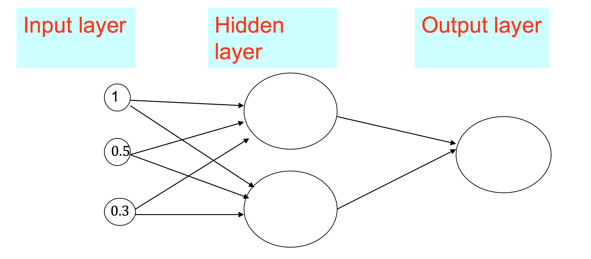

Machine Learning
-----------------------
**Why Kernel Method is useful?**

Machine learning techniques try to classify samples from different sets by looking for separators in space to separate them. However, in reality, samples cannot always be separable. It is something Kernel could help. Kernels map samples from low dimension to high dimension where the low-dimensional samples can be separated after being mapped to higher dimensional space.

The mapping/expanding process can be thought as deriving new features from old features. For instance, a sample [x1, x2] can be mapped to high dimension space [x1^2, x2^2, x1x2, x2x1]. If we can simply do this to any training samples and testing samples, then problem solved! Why do we need kernel? 

It turns out that doing this brutal force feature expanding is very computational expansive. Therefore, we need to come up with a smarter solution and that is kernel. 

**How it is achieved?**

The guy who invented kernel found a very important pattern of any machine-learning algorithm. That is they all (at least SVM and Perceptron) deal with the testing sample by doing dot product. Here is an example:

Where Wt is the separator in the Perceptron Algorithm while Xin is the training sample. The way it classifies the testing sample is by simply dot product the new samples with all its components:

See the interaction between the training data and the testing data? It dot products them.

The guy who invented kernel also found out that even expanding both training and testing sample to high dimensional space, the dot product result of them can be expressed in a *really simple* form. This way the computational cost is reduced while we can still enjoy the separability from high dimensional space.

What are the simple forms of the dot products depends on what kernel we use:

**What is linear function**
A linear function is just multiply between matrixes, the result of which is a polinomial function of degree zero or one. For instance, aX + b but not aX^2 + b. We can see linear function all over the place in machine learning algorithms in the form of WX + b where W is the weights, X is the data, and b is the bias. W and b are trained.

**Why linearity is so special**

Linear classifier: 

Linear XX

Linear decision boundary

**Generative and discriminative classifiers**

**Uderstand overfit**

Bias: 

Variance:

**Perceptron**
Perceptron uses two steps of computation to classify samples as one of the two labels. First, it does a dot product between linear seperator and input vector. Second it uses a threshold to test if the result from the dot production and output a binary value as the label. Here is an example of a two demension perceptron with a threshold b: Sign(W1*X1 + W2*X2 - b).

Perceptron can be thought of as a single-layer Neural Network.

A perceptron:

A Neural Network:

**How to train a perceptron**
In the online learning situation, where we get training data sequentially, the misclassified instance will contribute to the seperator by dragging it towards the direction of that misclassified sample a bit. Therefore next time the mistake is less likely to happen by a bit more. 

What if we have bounch of training data already and want to drain it all at once?

**Regression**
The goal of regression is to find the W (weights) vector to minimize the square error (also called loss function):

The way to do it is to use gradient descent:

The Phi() here is called "basis function" to make this rule generalizable to cases where we have X1X2 X1^2 or none linear forms of X such as:

 

Embedded System
----

Analog Circuit
----
**Good practice for bypass capacitor**

Kernel
-------

