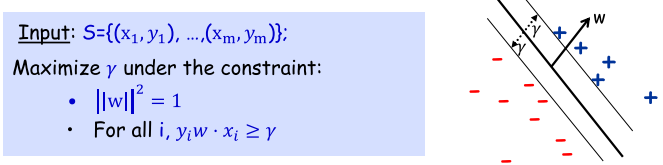

#Notes

##Machine Learning

###Kernel

**Why Kernel Method is useful?**

Machine learning techniques try to classify samples from different sets by looking for separators in space to separate them. However, in reality, samples cannot always be separable. It is something Kernel could help. Kernels map samples from low dimension to high dimension where the low-dimensional samples can be separated after being mapped to higher dimensional space.

The mapping/expanding process can be thought as deriving new features from old features. For instance, a sample [x1, x2] can be mapped to high dimension feature space [x1^2, x2^2, x1x2, x2x1]. This process is called feature map, where we usually use Phi(x) to represent the feature map function. If we can simply do this to any training samples and testing samples, then problem solved! Why do we need kernel? 

It turns out that doing this brutal force feature expanding is very computational expansive. Therefore, we need to come up with a smarter solution and that is kernel. 

**How it is achieved?**

The guy who invented kernel found a very important pattern of any machine-learning algorithm. That is they all (at least SVM and Perceptron) deal with the testing sample by doing dot product. Here is an example:


Where Wt is the separator in the Perceptron Algorithm while Xin is the training sample. The way it classifies the testing sample is by simply dot product the new samples with all its components:


See the interaction between the training data and the testing data? It dot products them.

The guy who invented kernel also found out that even expanding both training and testing sample to high dimensional space, the dot product result of them can be expressed in a *really simple* form. This way the computational cost is reduced while we can still enjoy the separability from high dimensional feature space. So we avoid working in the high demensional feature space explicitly. 

What are the simple forms of the dot products depends on what kernel we use:


There is a nice example of applying kernel method to perceptrons. <https://en.wikipedia.org/wiki/Kernel_perceptron>

###Perceptron
Perceptron uses two steps of computation to classify samples as one of the two labels. First, it does a dot product between linear seperator and input vector. Second it uses a threshold to test if the result from the dot production and output a binary value as the label. Here is an example of a two-demension perceptron with a threshold b: Sign(W1*X1 + W2*X2 - b).

Perceptron can be thought of as a single-layer Neural Network.

A perceptron:


**How to train a perceptron**

In the online learning situation, where we get training data sequentially, the misclassified instance will contribute to the seperator by dragging it towards the direction of that misclassified sample a bit. Therefore next time the mistake is less likely to happen by a bit more. 

Here is the code:

```
%Perceptron algorithm
%   w0 is the initial weight vector (d * 1)
%   X is feature values of training examples (d * n)
%   Y is labels of training examples (1 * n)

for j = 1 : n
	y_hat(j) = perceptron_pred(w , X(:,j));
		if(y_hat(j) ~= Y(j))
				w = w+Y(j)*X(:,j); % drag by adding the misclassified label to the weights vector
		end
end
```
**How to kernelize a perceptron**

Kernelized perceptron stores a counter vector that keep track of the times Xi is misclassified; and the set of training data as a trained model. The set of training data is stored in the form of a kernel matrix K as a lookup table. The kernel matrix should be constructed such that if X1 ∈ R d×n and X2 ∈ R d×m, then K ∈ R n×m. Note that each element of the K matrix is computed according to the kernel function. The polynomial kernel of degree-3 with an offset of 1 is defined as: 


So if we want to compute k(Xi, Xj), we can simply index K(i,j). Usually one of the X1 or X2 should be training data while the other is testing data. But during the training, we can use traning data as both X1 and X2. In this case, the K matrix is just another form of representing training data. 

Here is the code:
```
%Kernel perceptron algorithm
%   a is the count vector (1 * n)
%   X is feature values of training examples (d * n)
%   Y is labels of training examples (1 * n)

for i = 1 : n
        y_hat(i) = kernel_perceptron_pred(a, Y, K, i);
        if y_hat(i) ~= Y(i)
            a(i) = a(i)+1;
        end
end
```

where in kernel_perceptron_pred, we have:
```
%PERCEPTRON_PRED: Make prediction using Gram matrix of kernel,
%				past labels and counts, and index i.
%   a is counting vector (1 * n)
%   Y is labels of training examples (1 * n)
%	K is the Gram matrix such that K(i, j) = Kernel(X_i, X_j) 
%   i is the index of current observation

K_i = K(i,:);
pred = sign(sum((a.*Y)*K_i')); % i is the ith test sampe K_i is K(Xi, X[training samples]) 
```

###Naive Bayes

Chain rule is the basis of Bayes therom while Naive Bayes make Bayes therom more practical in real-world problem.

Compared with logistic regression, Naive Bayes is generative, which is derived from the joint distributtion of Y and X P(Y, X), instead of merely the probability distribution of Y given X P(Y | X). Therefore, it requires more training data to achieve good result.

Naive Bayes approach is a generative model since it tells a story of how the data is generated (both P(Y) and P(X|Y). But discrimitive model such as logistic regression how tells the current state of the data (P(Y|X)).


###Regression

The goal of linear regression is to find the W (weights) vector to minimize the square error (also called loss function). It is mathmatically the same thing with maximizing the likelihood of the conditional likelihood L(w; x,y), which is the probability of y given x, P(y | w, x), assuming that y ∈ R1 that are sampled iid such that yi ∼ N(ωTxi,σ2). The second way is how the logistic regression is trained, so it is in some sense more general between linear regression and logistic regreession.


The way to find w that maximize/minimize an particular expression (i.e. loss function, likelihood function) is to use gradient descent. Here is an example of traning logistic regression using gradient descent:
```
for k = 1:max_iter
    [f,g] = fv_grad( w, X, y );
    w = w + step * g;
	eps = abs((f - f_prev) / f_prev);
	    if eps <= stop_criteria
	        break;
	    end
end
```

where fv_grad returns the objective function value f and the gradient g w.r.t w at point w_curr:
```
tmp = -log(1+exp(w_curr'*X)) + y.*(w_curr'*X);
f = -sum(tmp,2); % f is negative log likelihood
g = (y - 1./(1+exp(-w_curr'*X)))*X'; 
g = g';
```

###Support Vector Machine

Unlike the training process for previous algorithm which try to maximize the possibility of observing the outcome of the training samples or minimizing the error, Support Vector Machine directly optimize for the maximum margin separator. 



Divide both side by gamma, we change the optimization to:


Where W' = W/gamma.

To allow errors we replace the inequality constraints with:


where 􏰗i are slack variables that allow an example to be in the margin (1 > 􏰗Yi > 0, also called a margin error) or misclassified (􏰗Yi > 1). Since an example is misclassified if the value of its slack variable is greater than 1, the sum of the slack variables is a bound on the number of misclassified examples. Minimizing ||w||2 can be augmented with a term CΣY􏰗i to penalize misclassification and margin errors. The optimization problem now becomes:


Using the method of Lagrange multipliers, the dual formulation of this optimization problem becomes:


This way, the final classifier is:  and The points Xi for which ai ≠ 0 are called the *support vector*.

[Assignments](./assignments/hw5.pdf)


###Boosting

First of all, boosting is a general method for improving the accuracy of any given learning algorithm. In general, boosting tries to find rules of thumb (highly accurate rule) by calling the weak learner repeatedly on cleverly chosen datasets:


Note that rules are different from features. 

**Adaptive boosting**


###Sample Complexity, PAC and VC Dimension
Sample complexity guarantees quantify how many training samples we need to see from the underlying data distribution D, inorder to guarantee that for all hypotheses in the class of target function we have their true error closer to their training error. This is important because we can only optimize for the training error but it is the generalization error (true error, the error if we apply the trained model to future data) that we really care about. The PAC and sample complexity also tells us how much data we need in order to get training error close to the generalization error with high probability:


Sample complexity of a machine learning algorithm is the number of training samples needed for the algorithm to successfully learn a target function with small error of both traning error and true error.


VC-Dimension provides a measure of the complexity of a "hypothesis space" which is your hypothesis of the data distributtion in the problem you want to solve. VC bounds are one kind of sample complexity guarantee, where the bound depends on the VC-dimension of the hypothesis class and they are particularly useful when the class of functions is infinite. 

The target function is generated from the hypothesis space. For instance, if your hypothesis is that the regression curve will be 2nd order polynomial, then one target function could be y = X^2 + 1. However, your hypothesis is your assumption about the truth and it decides how complex you want your model to be.


### Clustering
given a set S = {X1, .. Xn} of n points in d-dimensional space, the goal of k-means clustering is to find a set of centers c1, . . . , ck that minimize the k-means objective:


Note that min() ensure that we only sum up the distance of each point when it is assigned to the nearest center.

Brutal force all the partition posibilities can guarantee the optimal centers with minimal k-means objective, however the running time is exponential of the number of data points. Lloyd's Method is efficient in practice and often outputs reasonably good clusterings. It interates between two steps: improving partitioning and improving the centers. i.e., (i) improving the partitioning C1, . . . , Ck by reassigning each point to the cluster with the nearest center, and (ii) improving the centers c1, . . . , ck by setting ci to be the mean of those points in the set Ci for i = 1, ..., k. Note that Ci is cluster (i.e., points set) while ci is the center of a cluster. So we have pseudocode here: 


As we can tell, this method relys on how many clusters we assume and where the initial centers locates. For picking the number of clusters, we can run a k sweep and pick up an "elbow" point, since increasing the number of centers beyond this point results in relatively little gain. 

Intuitively we want each center to locate on each clusters with no multiple centers sharing the same cluster. For picking the initial locations of the centers, we can do it randomly or we can do k-means++ initialization approach where the initial centers are more likely to be one center per cluster.

### Bayesian Network
Bayes Network is a graphical model that represents a set of random variables and their conditional dependencies via a directed acyclic graph. D-seperation is a useful tool to decide wether two nodes or two groups of nodes are conditional dependent, conditioning on another node or another group of nodes.

### Hidden Markov Models
HMM is a special kind of Bayesian Network. In terms of the notion of d-separation, state nodes St-1 and St+1 are conditionally independent given St. Observation nodes Ot-1 and Ot+1 are conditionally independent given Ot. In fact, in the HMM graphical model, d-separation reduces to the common notion of separation in graphs. We have that any two subsets of nodes A and B are conditionally independent of a third one C, when the nodes in C and edges with endpoints in C are removed. 

Given a fixed HMM, i.e., a HMM with fixed parameters, Theta, Theta(start), Theta(stop), and Gamma, there are various queries that we may want to answer. For example, we could want to know what is the probability of a sequence of observations O1:T., PO1:T(O1:T). Evaluating this requires marginalizing over all posible sequences of states that may have generated O1:T, i.e.,


However, doing the summation naively is intractable. An efficient approach will exploit the HMM structure: given a sequence of observations O1:T, what is the most likely sequence of states S1:T that gave rise to O1:T. This is called MAP or Viterbi decoding and it is written as: 
 


We can do Viterbi decoding naively which has N to the squre of T time complexity, or we can derive an efficient algo. to do it.

### Markov blanket
The Markov blanket MB(v) of node v belongs to V is the set of parents, co-parents and children of v. Given v's MB(v), v is d-seperated from the rest of the nodes.


### Reinforcement Learning
What we do will affect what we see next.
Not only about prediction, but also about making decision.

Always want to maximize reward, but prefer ealier reward than later. Therefore, in the reward function, future rewards have less weights than current rewards. (weight decay)

Value function for each policy. Our goal is to find the policy that maximizes the value function.

Function to be learned is PI: S->A
The training instances are <<S,A>, R> S:state A:action R:reward

Supprisingly, the optimized policy for statei is also the optimized policy for statej.


### Markov Assumption
The probability of most recent state only depends on the last state and the action after the last state.

###MISC

**What is linear function**

A linear function is just multiply between matrixes, the result of which is a polinomial function of degree zero or one. It can always be represented by W . X. For instance, aX + b but not aX^2 + b. We can see linear function all over the place in machine learning algorithms in the form of WX + b where W is the weights, X is the data, and b is the bias. W and b are trained.

**Understand overfit**

Bias and Variance are used to evaluate an algorithm (our hypothesis about the data distribution in the dataset):

Bias: How accurate the model is to predict current dataset, when using this algorithm.
Variance: How various the models are when apply the same algorithm across different datasets.

We see an algorithm with small bias but big variance, and that is overfit.

## Neural Network

### Backpropagation
Backpropagation is a common methond for training a neural netowrk. The two phases include 1. propagtion and 2. weight update. And repeat phase 1 and phase 2 until the performace of the network is satisfactory (optimize the weights). 


1. Forward propagation of a training pattern's input through the neural network in order to generate the propagation's output activations.

2. Calculate the total error and the partial derivative of Etotal with respect to all weights (how much a change in Wi affects the total error.) This is done by applying chain rule of the the gradient. (<http://cs231n.github.io/optimization-2/#backprop>)

3. We substract the derivatives times by certain ratio from the current weights and use the updated weights for next iteration.

This ratio (percentage) influences the speed and quality of learning; it is called the learning rate. The greater the ratio, the faster the neuron trains; the lower the ratio, the more accurate the training is. The sign of the gradient of a weight indicates where the error is increasing, this is why the weight must be updated in the opposite direction.

A nice animation: <https://mattmazur.com/2015/03/17/a-step-by-step-backpropagation-example/>

Deeper network is more expressive.

Parallelism: Neural network involves a lot of matrix multiplitation which can be accelerated by modern hardware. This makes computation for deeper network no longer computationally imposible. There exist a lot of tools (e.g., tensorflow) takes neural network training as a sequence of matrix operations.

Use softmax and cross-entropy loss to improve (accelerate, more stable) deep neural network.

###Convolutional Neural Network or (CNN)
CNN is a type of neural network however, each note is an image (matrix) instead of a value, while each weight is a matrix instead of a value. The convolutions between Weights and inputs compute the output, rater that the multiplications. By making explicit assumption that the inputs are images, CNN encodes certain properties into the architecture. These then make the forward function more efficient to implement and vastly reduce the amount of parameters in the network.

CNN basically chains up convolutions and combines them by downsampling.

Deeplearning abstract useful features from raw images which reduces number of features comparing with using raw images as features.

Here is a nice tutorial with an animation of CNN (<http://cs231n.github.io/convolutional-networks/>)


##Deep Learning 

###Neural Network

example of 2d matrix convolution: http://www.songho.ca/dsp/convolution/convolution2d_example.html

Convolutional neural networks alternate between convolutional and pooling layer 


Why pooling: 
1) we cain robustness to extract spatial location of features (i.e. make detection robust to the exact location of the eye (see figure below)):


2) lower the translation variances for more stable result (or introducing invariance):


Why need rectification? It is also for more stable result with invariance. For, eg. gain stability by lossing information such as whether an edge is black-to-white or white-to-black:


Simple fact of convolutional network:


To train a neural net, we need 1) Loss function 2) A procedure to ompute gradients:


Here is a good online two-layer neural network python implementation that shows 1) the good property of sigmoid 2) reducing error by calculating error-weighted derivatives in the back propagations, and adding them to the weights to update.

http://iamtrask.github.io/2015/07/12/basic-python-network/

In the above example the output is binary. However, in a more realistic case where we have multiple labels, we can use softmax regression together with cross-entropy entropy function (loss funtion). Good thing about the softmax regression is it gives us a list of values between 0 and 1 that add up to 1 (probabilities of each label add up to 1). So the output layer is softmax.
https://www.tensorflow.org/versions/master/tutorials/mnist/beginners/index.html

Here is a nice illustration of this architecture:


where xj (first column) is the pixels of an image, Wi,j is the weight of computing pixel j being part of label i. All the evidance tallies are then fed into a softmax layer to compute the possibilities.

Here are the following computations:


##Analog

###Setup dc bias for aplifier
Voltage follower biasing compared with voltage divider biasing is more power-efficient, can be used to power many circuits (the same as voltage divider biasing), the affect to other part of the circuit is infinitesimal.

###Bypass Capacitor

**where to put it:** As close to the IC's power input as possible. Extra distance increase the additional series inductance which lowers the bandwidth of frequencies the capacitor can bypass. In wide bandwidth circuits, the amount of series inductance sets an upper bound on the ability of the bypass circuit to provide a low impedance for the power supply pin.

**Different capacitors:** Ceramic capacitors are the most common capacitor type since they are inexpensive, offer a wide range of values, and provide
solid performance. 
Tantalum, OSCON, and Aluminum Electrolytic capacitors are all polarized (specifically to be used as a bypass capacitor). 

Tantalum found their niche in low-voltage systems.

Aluminum electrolytic capacitors are a common choice for lowto-medium frequency systems, but not switching circuits (they
hold their charge too well which doesn’t suit them for the rapid
cycling of production testing). 

OSCON is a special capacitor type developed to provide low parasitics, wide frequency range and full temperature range (the best quality available for the highest price tag). If you have the budget, these capacitors will provide quality bypass for any circuit.

For a good practice we use three capacitors with different value to bypass wideband of noise. Note that the values always differ by the level of magnitude of 10 and also we chose smaller package size for smaller capacitors. If the same package was used for each of the capacitors,
their high frequency responses will the same. Effectively, this negates the use of the smaller capacitors. See figure: 


Here is a good tutorial of [how to choose bypass fileter](./Analog/bypass_cap.pdf)

###Reduce EMI Noise on PCB

###Antenna Impedance Match

### Eagle 

snap-on-grid-sch.ulp


##Others

###Kappa statistic
Classifiers built and evaluated on data sets of different class distributions can be compared more reliably through the kappa statistic. Using kappa statistic, we allow models of different class distributions to be more easily compared.
<http://stats.stackexchange.com/questions/82162/kappa-statistic-in-plain-english>


