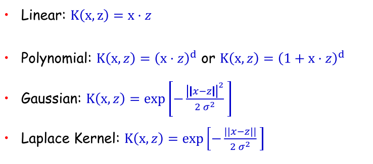

Machine Learning
-----------------------
Why Kernel is useful. 

Machine learning techniques try to classify samples from different sets by looking for seperators in space to seperate samples with different labels. However, in reality, samples cannot alway be seperatable. It is where Kernel could be powerful. Kernels map features from low dimension to high dimension where the low-dimensional samples become saperatable after being mapped to higher demensional space.

How it is achieved. 

The mapping process can be thought as derive new features from old features. For instance, a sample [x1, x2] can be mapped to high demension space [x1^2, x2^2, x1x2, x2x1]. If we can simply do this to any training data and testing data, then problem solved! Why do we need kernel? 

It turns out that doing this brutal force feature expanding is very computational expansive. Therefore, we need to come up with a smarter solution and that is kernel. The guy who invented kernel found an very important pattern of any machine learning algorithm. That is they all deal with the testing data by doing dot product. Here is an example:

Where Wt is the seperator in the Perceptron Algorithm while Xin is the training sample. The way it classifies the testing sample is by simply dot product the new datapoint with all its components:

See the interaction between the training data and the testing data? It dot products them.

The guy who invented kernel found out that even expanding both training and testing sample to high dimensional space, the dot product result of them can be expressed in a *really simple* form. This way the computational cost is reduced while we can still enjoy the seperatability from high dimensional space.

What are the simple forms of the dot products depends on what kernel we use:

Embeded System
----

Kernel
-------

